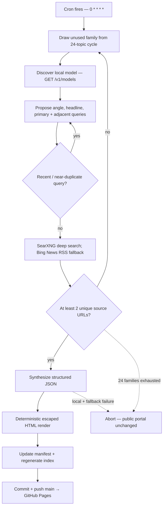

<div align="center">


# Markgitup Research Desk

**An autonomous, source-gated research portal — published hourly, on the hour.**

Twenty-four durable AI and technology topic families feed a local-first research pipeline. It finds a fresh angle, gathers source-linked evidence, rejects thin or repeated work, renders deterministic static HTML, and deploys to GitHub Pages.

### [→ Read the live desk](https://c1t1zen1.github.io/markgitup-research-desk/)

[](https://c1t1zen1.github.io/markgitup-research-desk/)
[](#how-a-dispatch-gets-made)
[](#topic-families)
[](#integrity-model)
[](https://github.com/c1t1zen1/markgitup-research-desk/commits/main)
[](https://www.python.org/)
[](https://searxng.org/)
[](#inference-chain)

<a href="https://c1t1zen1.github.io/markgitup-research-desk/">
  
</a>

<sub><i>The live desk — click through to read it. <a href="docs/portal-light.png">Light theme →</a></i></sub>

</div>

---

## Contents

- [What this is](#what-this-is)
- [How a dispatch gets made](#how-a-dispatch-gets-made)
- [Topic families](#topic-families)
- [Integrity model](#integrity-model)
- [Inference chain](#inference-chain)
- [The portal](#the-portal)
- [Local weather hero and privacy](#local-weather-hero-and-privacy)
- [Repository layout](#repository-layout)
- [Configuration](#configuration)
- [Running it](#running-it)
- [Tests and verification](#tests-and-verification)
- [Credits](#credits)

---

## What this is

Markgitup is an unattended research desk. A scheduled publisher on a Raspberry Pi completes the loop once per hour:

1. Choose an unused family from a persistent 24-topic cycle.
2. Ask a local model for a current angle and a primary plus adjacent search plan.
3. Reject recent or semantically overlapping queries before retrieval.
4. Search self-hosted SearXNG; use Bing News RSS direct-publisher links if SearXNG returns no results.
5. Require at least two unique sources before any article synthesis begins.
6. Generate validated JSON only, then deterministically escape and render the article HTML.
7. Update `manifest.json`, regenerate the static portal, commit, and push `main` for GitHub Pages.

The LLM does not author executable markup. If local and fallback inference both fail, or evidence remains insufficient across the topic cycle, the run exits without mutating the public portal.

## How a dispatch gets made



### Freshness and coverage controls

| Control | Behavior |
|---|---|
| Topic cycle | `data/topic-cycle.json` prevents repeats until every one of 24 families has been attempted. |
| Query ledger | `data/search-history.json` records every attempted query, including failed retrievals. |
| Novelty cooldown | Exact and semantic near-duplicates are rejected for the configured 3-day window. |
| Search breadth | A primary query plus 3–5 adjacent lenses are attempted; retained evidence is URL-deduplicated and capped at 12 sources. |
| Source gate | Fewer than two unique sources discards the angle and advances to another family. Default retry budget: the complete 24-family cycle. |
| Failure behavior | No source-only fallback articles. Failed runs leave the previous live portal intact. |

Reports discovered with zero usable sources are retained for audit in [`BAD/`](BAD/) and excluded from the active index.

## Topic families

The fixed families keep coverage broad while allowing each run to pursue a genuinely current signal.

| Politics and governance | Apple Silicon and local AI | Markets and finance | Video and synthetic media |
|---|---|---|---|
| AI elections and campaigns | M-series inference | AI market analysis | Video generation models |
| AI lobbying and policy | Local macOS AI stacks | LLMs in hedge funds | AI filmmaking and content creation |
| Deepfake law | Quantized local models | AI crypto trading | Short-form social video |
| AI intelligence and surveillance | Privacy-first local AI | Financial fraud detection | Video avatars and virtual presenters |
| Election misinformation | Apple Silicon development tools | Financial reporting | AI post-production |

Additional cross-cutting families: AI mental health and therapy, AI legal practice, AI-powered smart homes, and autonomous AI code agents.

## Integrity model

1. **Model output is JSON, never page code.** Article data is rendered by the publisher; untrusted values are escaped before they reach HTML.
2. **Evidence stays untrusted.** Search snippets are explicitly treated as untrusted material in synthesis prompts. The model cites supplied sources by number; it cannot inject its own URLs.
3. **Source thresholds are enforced repeatedly.** The pipeline rejects insufficient evidence before synthesis; public index rendering independently filters records with fewer than two sources or an `archived` flag.
4. **URLs are constrained.** Rendered source links must be `http://` or `https://`.
5. **Forecasts are labelled as forecasts.** Editorial prompts require clear separation of established facts, uncertainty, and projections.
6. **Failure is silence, not fabrication.** No retrieval or inference fallback generates a speculative article just to fill an hour.

## Inference chain

Markgitup is local-first.

```text
Local OpenAI-compatible server
  ├─ discover model dynamically through /v1/models
  ├─ two bounded local attempts
  ├─ DeepSeek V4: thinking-disabled streaming controls
  └─ legacy llama.cpp-compatible models: non-stream controls
          │
          └─ unavailable, timeout, or invalid JSON
                    │
                    ▼
Fallback: GPT 5.6 Luna through Hermes openai-codex
                    │
                    └─ failure → abort before public writes
```

The publisher captures the actual model attribution in each manifest entry and article footer. It accepts a local response only when it parses as the required JSON shape; reasoning-only output routes to fallback rather than being published.

## The portal

[`index.html`](https://c1t1zen1.github.io/markgitup-research-desk/) is a static, framework-free landing page regenerated from `manifest.json`.

- **Progressive card mounting:** featured article plus only enough cards for the viewport and about two measured rows ahead.
- **Full-archive search:** compact safe card metadata stays embedded, so filtering covers unmounted articles without loading article pages.
- **Responsive loading:** `IntersectionObserver`, passive-scroll fallback, and an accessible **Load more articles** button append rows without replacing already visited cards.
- **Accessible controls:** semantic links, live loaded-count status, keyboard focus on appended cards, and a manual day/night control.
- **Defensive rendering:** entries remain newest-first; archived and under-sourced records never surface; manifest text uses DOM text nodes instead of untrusted `innerHTML`.
- **No article fetch on scroll:** article HTML loads only after a reader opens a card.

This is progressive DOM rendering, not network pagination or full virtualization.

## Local weather hero and privacy

The landing-page hero is a decorative, real-time local sky. It is deliberately independent of article generation and does not run on article pages.

### What the visitor sees

- A day/night lighting palette and calculated Sun or Moon position.
- Lunar phase, illumination, and a bundled NASA LRO albedo texture.
- WMO-aware clear, cloud, fog, rain, snow, and storm treatments.
- Bounded particles that respect `prefers-reduced-motion` and pause outside the viewport.
- A visible, expandable privacy and attribution disclosure.

### Per-visit browser flow

1. Browser requests `https://get.geojs.io/v1/ip/geo.json` directly, without the Geolocation/GPS API.
2. It rounds latitude and longitude to 0.1 degrees, checks GeoJS `country_code` only to choose temperature units (`°F` for `US`, `°C` otherwise), then discards IP, city, organization, country code, and other returned fields.
3. Browser requests Open-Meteo current model-based weather with the selected temperature unit plus `credentials: omit`, `cache: no-store`, and `referrerPolicy: no-referrer`.
4. Validated weather plus local Astronomy Engine calculations produce the scene. Stale, malformed, denied, or timed-out data gives a neutral usable fallback.

Markgitup does not store visitor coordinates, weather, identifiers, cookies, or theme preference for this feature. GeoJS receives the visitor IP to estimate a region; Open-Meteo receives the rounded coordinates and visitor IP. VPNs, mobile networks, and IP geolocation can place the sky elsewhere. Open-Meteo's free endpoint has non-commercial rate and use limits; this is model-based regional weather, not an instrument reading.

Attribution and licenses appear in the visible disclosure and the versioned `cronjob/markgitup-weather/` bundle:

- [GeoJS](https://www.geojs.io/privacy/) / MaxMind GeoLite for approximate IP region
- [Open-Meteo](https://open-meteo.com/en/terms) for weather
- [NASA Scientific Visualization Studio](https://svs.gsfc.nasa.gov/4720/) for lunar texture source
- [Astronomy Engine](https://github.com/cosinekitty/astronomy) for astronomy calculations

## Repository layout

```text
.
├── index.html                         # Generated static portal
├── manifest.json                      # Published-dispatch ledger
├── html/                              # Standalone source-linked articles
├── BAD/                               # Quarantined zero-source reports
├── data/
│   ├── topic-cycle.json               # Persistent 24-family cycle
│   └── search-history.json            # Query novelty ledger
├── docs/                              # README visual assets
└── cronjob/                           # Versioned publisher archive; not scheduler runtime
    ├── markgitup-html-cron.py         # Mirror of canonical publisher
    ├── markgitup-html-cron-launcher.py
    ├── markgitup-weather/             # Astronomy, weather, paint, CSS, licenses, Node tests
    ├── test_markgitup_html_cron.py
    ├── test_markgitup_index_browser.py
    ├── test_markgitup_weather_browser.py
    └── README.md                      # Sync, checks, and restore procedure
```

> `cronjob/` is a versioned archive. Canonical source is `/home/pi/Documents/Hermes-Jetson/scripts/markgitup-html-cron.py`; edit and test it there, then synchronize this archive byte-for-byte. The scheduler launcher at `/home/pi/.hermes/scripts/markgitup-html-cron.py` executes the canonical source.

## Configuration

| Variable | Default | Purpose |
|---|---|---|
| `MARKGITUP_PORTAL_DIR` | `/home/pi/Documents/HTML-Portal` | Portal checkout to update and push |
| `MARKGITUP_SEARXNG_URL` | `http://127.0.0.1:8888/search?q={}&format=json` | Primary metasearch endpoint |
| `MARKGITUP_AI_API_URL` | `http://192.168.0.219:8080/v1/chat/completions` | Local OpenAI-compatible inference endpoint |
| `MARKGITUP_MODEL` | `local-llm` | Degraded fallback selector if model discovery is unavailable |
| `MARKGITUP_CODEX_MODEL` | `gpt-5.6-luna` | Hermes fallback model |
| `MARKGITUP_CODEX_PROVIDER` | `openai-codex` | Hermes fallback provider |
| `MARKGITUP_STATUS_PATH` | `~/.hermes/cron/markgitup-local-inference-status.json` | Credential-free local inference heartbeat |
| `MARKGITUP_MINIMUM_SOURCES` | `2` | Source gate floor; cannot be reduced below 2 |
| `MARKGITUP_SOURCE_RETRIES` | `24` | Topic families attempted before a no-write abort |
| `MARKGITUP_ANGLE_RETRIES` | `3` | Fresh angle attempts for one family |
| `MARKGITUP_COOLDOWN_DAYS` | `3` | Near-duplicate query cooldown |

## Running it

Requirements: Python 3.11+, a reachable SearXNG JSON endpoint, a local OpenAI-compatible inference endpoint or configured Hermes fallback, Chromium, Node.js, and Python `websockets` for the browser suites.

```bash
# Canonical publisher path. --no-push generates locally but does not publish.
cd /home/pi/Documents/Hermes-Jetson
python3 scripts/markgitup-html-cron.py --no-push

# Override portal and services without editing source.
MARKGITUP_PORTAL_DIR="$PWD" \
MARKGITUP_SEARXNG_URL="http://localhost:8888/search?q={}&format=json" \
MARKGITUP_AI_API_URL="http://localhost:8080/v1/chat/completions" \
python3 scripts/markgitup-html-cron.py --no-push

# Serve a static checkout locally.
python3 -m http.server 8787
```

Production schedule:

```cron
0 * * * * /usr/bin/python3 /home/pi/.hermes/scripts/markgitup-html-cron.py
```

Never edit the root README from the hourly publisher. It is hand-maintained documentation.

## Tests and verification

The weather and progressive-index changes are covered by real generated HTML in Chromium, not just string assertions.

```bash
cd /home/pi/Documents/Hermes-Jetson

# Pure JavaScript astronomy, painting, and transport coverage.
node --test scripts/markgitup-weather/test-*.cjs

# Publisher, progressive index, and weather browser coverage.
/home/pi/.hermes/hermes-agent/venv/bin/python -m unittest \
  scripts.test_markgitup_html_cron \
  scripts.test_markgitup_index_browser \
  scripts.test_markgitup_weather_browser

python3 -m py_compile \
  scripts/markgitup-html-cron.py \
  scripts/test_markgitup_html_cron.py \
  scripts/test_markgitup_index_browser.py \
  scripts/test_markgitup_weather_browser.py

git diff --check
```

Current validated coverage:

- **16 Node tests:** astronomy rise/set boundaries, phase/illumination, lunar terminator shading, WMO classification, private browser fetch behavior, malformed/stale data, timeout/abort handling, and fresh-visit behavior.
- **53 Python tests:** publisher contracts, inference fallback behavior, progressive loading/search/exhaustion, desktop/mobile browser layout, weather states, Moon movement, provider failure, no GPS/storage, BFCache refresh, reduced motion, and offscreen particle pause.
- The exact archive mirror is also tested from `HTML-Portal/cronjob/` before deployment.

For deployment, wait for an active publisher to finish; fetch and compare `HEAD...origin/main`; stage only intended files; push without force; then verify `HEAD == origin/main`, remote file bytes, the Pages source, and a cache-busted live URL. Preserve unrelated runtime changes such as `data/topic-cycle.json`.

## Credits

Built and operated by [@c1t1zen1](https://github.com/c1t1zen1), maintained with Hermes Agent, and published through GitHub Pages.

Standing on [SearXNG](https://searxng.org/) for discovery, local OpenAI-compatible and llama.cpp-family inference stacks, [Open-Meteo](https://open-meteo.com/), [GeoJS](https://www.geojs.io/), [Astronomy Engine](https://github.com/cosinekitty/astronomy), NASA lunar imagery, and GitHub Pages.

<sub>Markgitup is research tooling, not journalism or operational weather guidance. Verify material claims before relying on them.</sub>
