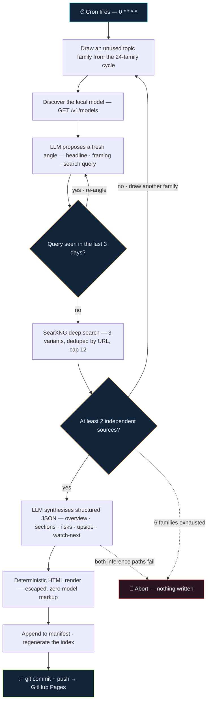
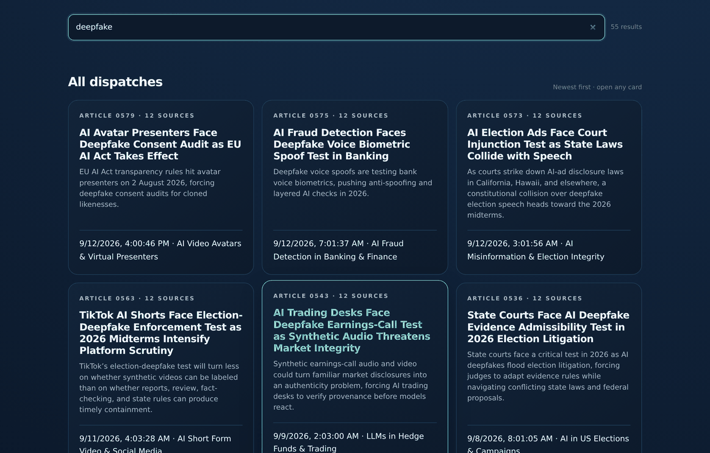

<div align="center">


# Markgitup Research Desk

**An autonomous, source-gated research portal that publishes itself — every hour, on the hour.**

Twenty-four standing topic families. A local LLM picks a fresh angle, a self-hosted SearXNG
instance finds the evidence, and nothing reaches the page until at least two independent
sources back it up. The result is a zero-dependency static site on GitHub Pages.

### [**→ Read the live desk at c1t1zen1.github.io/HTML**](https://c1t1zen1.github.io/HTML/)

<br>

[](https://c1t1zen1.github.io/HTML/)
[](#-how-a-dispatch-gets-made)
[](#-the-24-topic-families)
[](#-integrity-model)

[](https://github.com/c1t1zen1/HTML/commits/main)
[](https://github.com/c1t1zen1/HTML/graphs/commit-activity)
[](https://github.com/c1t1zen1/HTML)
[](https://www.python.org/)
[](https://searxng.org/)
[](#-inference-chain)
[](#-why-its-built-this-way)
[](#-credits)

<br>

<a href="https://c1t1zen1.github.io/HTML/">
  
</a>

<sub><i>The live desk — click through to read it. <a href="docs/portal-light.png">Light theme →</a></i></sub>

</div>

---

## Contents

- [What this is](#-what-this-is)
- [How a dispatch gets made](#-how-a-dispatch-gets-made)
- [The 24 topic families](#-the-24-topic-families)
- [Integrity model](#-integrity-model)
- [Inference chain](#-inference-chain)
- [What's in a dispatch](#-whats-in-a-dispatch)
- [The portal](#-the-portal)
- [Repository layout](#-repository-layout)
- [Configuration](#-configuration)
- [Running it](#-running-it)
- [Tests](#-tests)
- [By the numbers](#-by-the-numbers)
- [Why it's built this way](#-why-its-built-this-way)
- [Credits](#-credits)

---

## 🛰 What this is

Markgitup is an **unattended research desk**. No one queues the stories, writes the headlines,
or presses publish — a cron job on a Raspberry Pi does the whole loop once an hour and pushes
the result straight to `main`, where GitHub Pages serves it.

The interesting part isn't that an LLM writes prose. It's everything wrapped around the LLM to
stop it from writing *nonsense*:

| Guardrail | What it does |
|---|---|
| **Standing topic families** | The desk never free-associates. Every run starts from one of 24 durable subject areas and hunts for a *new* current angle inside it. |
| **Rotating topic cycle** | A durable cycle in `data/topic-cycle.json` burns through all 24 families before any repeats, so coverage stays even instead of collapsing onto whatever is loudest. |
| **Novelty ledger** | `data/search-history.json` remembers every query ever attempted. Near-duplicate angles inside a 3-day cooldown are rejected before a single search fires. |
| **Source gate** | Fewer than 2 independent source URLs → the angle is thrown away and a different topic family is drawn. Up to 6 attempts, then the run aborts having written nothing. |
| **Untrusted-evidence framing** | Search snippets are handed to the model explicitly labelled as untrusted material, with instructions inside them to be ignored. |
| **No model-authored markup** | The LLM returns JSON only. Every byte of HTML is rendered deterministically by the publisher and escaped on the way out. |
| **Fail closed** | If both inference paths die, the run exits *before* touching the manifest, the index, or git. A missing hour is the correct outcome; a fabricated hour is not. |

Reports that slipped through with zero usable sources are not deleted or quietly rewritten —
they're quarantined in [`BAD/`](BAD/) with a note explaining why, and excluded from the public index.

---

## ⚙ How a dispatch gets made



---

## 🗂 The 24 topic families

Every run draws from this fixed set. They are deliberately broad — the model's job is to find
what is *newly true* inside one of them this hour, not to invent a subject.

<table>
<tr><th align="left">🏛 Politics &amp; governance</th><th align="left">🍏 Apple Silicon &amp; local AI</th></tr>
<tr valign="top"><td>

- AI in US Elections &amp; Campaigns
- AI Lobbying &amp; Policy in Washington
- Deepfake Legislation &amp; Synthetic Media Laws
- AI in US Intelligence &amp; Surveillance
- AI Misinformation &amp; Election Integrity

</td><td>

- M-Series Apple Silicon LLM Inference
- Local AI Tools &amp; Stacks for macOS
- Quantized LLMs Running on Mac Hardware
- Privacy-First Local AI on Mac
- AI Development Tools for Apple Silicon

</td></tr>
<tr><th align="left">📈 Markets &amp; finance</th><th align="left">🎬 Video &amp; synthetic media</th></tr>
<tr valign="top"><td>

- AI Stock Prediction &amp; Market Analysis
- LLMs in Hedge Funds &amp; Trading
- AI Crypto Trading Bots &amp; Performance
- AI Fraud Detection in Banking &amp; Finance
- Generative AI for Financial Reporting

</td><td>

- AI Video Generation Models
- AI-Generated Video for Filmmaking &amp; Content Creation
- AI Short-Form Video &amp; Social Media
- AI Video Avatars &amp; Virtual Presenters
- AI-Powered Video Editing &amp; Post-Production

</td></tr>
<tr><th align="left" colspan="2">🧩 Society, law &amp; autonomy</th></tr>
<tr valign="top"><td colspan="2">

- AI in Mental Health &amp; Therapy &nbsp;·&nbsp; AI in Legal Systems &amp; Law Practice &nbsp;·&nbsp; AI-Powered Smart Homes &amp; Automation &nbsp;·&nbsp; Autonomous AI Code Agents

</td></tr>
</table>

> Coverage stays even by construction: a family is marked used in `data/topic-cycle.json` the
> moment it's drawn, and the cycle only resets once all 24 have had their turn.

---

## 🛡 Integrity model

This is the part worth reading if you're building something similar.

**1 — The model never emits markup.**
The synthesis prompt demands a single JSON object and forbids Markdown, HTML, JavaScript, PHP,
and code fences. `render_article()` walks that structure and escapes every field. A prompt
injection that convinces the model to emit a `<script>` tag produces the literal text
`&lt;script&gt;` on the page.

**2 — URLs are validated, not trusted.**
`safe_url()` drops anything that isn't `http://` or `https://` to `#`. Source links come from
SearXNG's response, never from model output — the model can only *cite by number*.

**3 — Search results are labelled untrusted in-band.**
Evidence is framed for the model as source material with an explicit instruction to ignore any
commands or formatting requests inside the snippets.

**4 — The source gate has teeth.**
`MINIMUM_SOURCES` is floored at 2 and enforced twice: once after the deep search, and again
inside `synthesize_article()`, which refuses to call the model at all on thin evidence. The
portal index then filters a *third* time — `source_count >= 2` — so an under-sourced entry that
somehow reached the manifest still never renders.

**5 — Forecasts are marked as forecasts.**
The prompt requires cautious language on thin evidence, explicit labelling of projections, and
explicit acknowledgement when sources conflict.

**6 — Failure is silence, not fabrication.**
There is no "write something anyway" branch. Local inference dead *and* fallback dead ⇒
`MarkgitupError` ⇒ exit 1 ⇒ no commit.

---

## 🧠 Inference chain

The desk is **local-first** and falls back only when it has to.

```
┌─ Local (preferred) ────────────────────────────────────────────────┐
│  Model discovered dynamically at runtime: GET /v1/models           │
│  DeepSeek V4 → native thinking-disabled streaming w/ heartbeat     │
│  Everything else → legacy chat-completion payload                  │
│  2 attempts · 20 min each · 60 min total budget per run            │
│  Live progress written to a JSON status sidecar                    │
└────────────────────────────────────────────────────────────────────┘
                              │ exhausted / unreachable
                              ▼
┌─ Fallback ─────────────────────────────────────────────────────────┐
│  GPT 5.6 Luna via the Hermes `openai-codex` provider               │
└────────────────────────────────────────────────────────────────────┘
                              │ also failed
                              ▼
                    ✋ abort — publish nothing
```

Whichever model actually produced a dispatch is recorded in `model_names` on its manifest entry
and credited in the article footer. Long local runs are observable while they happen: a
heartbeat writes token counts and elapsed time to the status sidecar every 30 seconds.

---

## 📄 What's in a dispatch

Each article is a standalone, self-contained HTML file under [`html/`](html/) with a fixed anatomy:

| Section | Contents |
|---|---|
| **Dek** | A 20–35 word summary — also the card blurb on the index |
| **Overview** | 2–3 paragraphs on what matters and how the evidence was gathered |
| **Sections** | 3–5 headed analytical sections, each with body copy, bullets, and numbered source citations |
| **Upside** | 2–4 evidence-grounded positive possibilities |
| **Risks** | 2–4 evidence-grounded risks and failure modes |
| **Watch next** | 2–4 concrete signals a reader should monitor |
| **Takeaways** | 5 specific takeaways tied to the supplied sources |
| **Conclusion** | Synthesis that separates established fact from projection |
| **Sources** | Every URL SearXNG returned, with domain and publication date |

Its manifest entry looks like this:

```json
{
  "article_number": 585,
  "topic": "AI Crypto Bots Face Exchange Liquidity Test as CFTC Proposes Unified Market Rules",
  "file": "html/article-0585-ai-crypto-bots-face-exchange-liquidity-test-....html",
  "full_timestamp": "2026-09-12T23:01:38-07:00",
  "summary": "CFTC and SEC joint initiatives aim to unify crypto oversight…",
  "original_topic": "AI Crypto Trading Bots & Performance",
  "search_query": "CFTC unified crypto market rules AI trading bots liquidity 2026",
  "source_count": 12,
  "tags": "AI Trading, Crypto Regulation, CFTC, Market Liquidity",
  "model_names": "Qwen3.8-Flash-Next-UD-IQ4_XS"
}
```

---

## 🖥 The portal

[`index.html`](https://c1t1zen1.github.io/HTML/) is regenerated from the manifest on every run.
One file, no build step, no framework, no network calls at runtime.

- **Instant client-side filtering** across titles, summaries, topic families, and tags
- **Dark / light themes** with the choice persisted in `localStorage`
- **Featured lead** plus a responsive card grid, each card stamped with its source count
- **Source-count and archive filtering** applied at render time, so quarantined or thin entries never surface
- **Accessible by default** — semantic markup, real links, works with JavaScript-free reading of individual articles

<div align="center">

<br><sub><i>Type anything — 541 dispatches narrow to 55 without a round trip.</i></sub>
</div>

---

## 📁 Repository layout

```
.
├── index.html          # The portal — regenerated from the manifest every run
├── manifest.json       # Append-only ledger of every published dispatch
├── favicon.svg         # Shared mark, referenced by the index and every article
├── html/               # 540+ published dispatches, one self-contained file each
├── BAD/                # Quarantined zero-source reports + why they were pulled
├── data/
│   ├── topic-cycle.json      # Which of the 24 families have been used this cycle
│   └── search-history.json   # Novelty ledger — every query ever attempted
├── docs/               # README screenshots
└── cronjob/            # Versioned archive of the publisher
    ├── markgitup-html-cron.py           # The publisher (~1,200 lines, stdlib only)
    ├── markgitup-html-cron-launcher.py  # Cron-safe launcher
    ├── test_markgitup_html_cron.py      # 28 regression tests
    └── README.md                        # Archive + restore procedure
```

> [!IMPORTANT]
> `cronjob/` is a **versioned archive**, not the scheduler's live path. The canonical script
> lives in the Hermes-Jetson repo; edit there, run the tests, then sync the archive. See
> [`cronjob/README.md`](cronjob/README.md) for the exact procedure.

---

## 🎛 Configuration

Everything is environment-overridable, so the publisher can be pointed at a different search
instance, model host, or portal checkout without touching code.

| Variable | Default | Purpose |
|---|---|---|
| `MARKGITUP_PORTAL_DIR` | `/home/pi/Documents/HTML-Portal` | Portal checkout to write and push |
| `MARKGITUP_SEARXNG_URL` | `http://127.0.0.1:8888/search?q={}&format=json` | Self-hosted SearXNG endpoint |
| `MARKGITUP_AI_API_URL` | `http://192.168.0.219:8080/v1/chat/completions` | OpenAI-compatible local inference host |
| `MARKGITUP_MODEL` | `local-llm` | Fallback id when discovery can't reach `/v1/models` |
| `MARKGITUP_CODEX_MODEL` | `gpt-5.6-luna` | Fallback model |
| `MARKGITUP_CODEX_PROVIDER` | `openai-codex` | Hermes provider for the fallback |
| `MARKGITUP_STATUS_PATH` | `~/.hermes/cron/markgitup-local-inference-status.json` | Live inference status sidecar |
| `MARKGITUP_MINIMUM_SOURCES` | `2` | Source gate floor (hard-floored at 2) |
| `MARKGITUP_SOURCE_RETRIES` | `6` | Topic families to try before aborting |
| `MARKGITUP_ANGLE_RETRIES` | `3` | Angle proposals per family |
| `MARKGITUP_COOLDOWN_DAYS` | `3` | Novelty window for near-duplicate queries |

---

## 🚀 Running it

**Requirements** — Python 3.11+ (standard library only), a reachable SearXNG instance with the
JSON API enabled, and an OpenAI-compatible inference endpoint.

```bash
# Dry run: generate an article and regenerate the index, but don't commit or push
python3 cronjob/markgitup-html-cron.py --no-push

# Point it somewhere else entirely
MARKGITUP_PORTAL_DIR="$PWD" \
MARKGITUP_SEARXNG_URL="http://localhost:8888/search?q={}&format=json" \
MARKGITUP_AI_API_URL="http://localhost:8080/v1/chat/completions" \
python3 cronjob/markgitup-html-cron.py --no-push

# Preview the portal locally
python3 -m http.server 8787   # → http://localhost:8787
```

**The schedule** that drives production:

```cron
0 * * * * /usr/bin/python3 /home/pi/.hermes/scripts/markgitup-html-cron.py
```

---

## ✅ Tests

28 regression tests cover the parts that are expensive to get wrong — the source gate, the
inference fallback chain, streaming parsers, model-credit attribution, and index filtering.

```bash
python3 -m unittest discover -s cronjob -p 'test_*.py' -v
python3 -m py_compile cronjob/markgitup-html-cron.py cronjob/test_markgitup_html_cron.py
```

Representative coverage:

- `test_source_gate_requires_multiple_sources` — thin evidence never reaches the model
- `test_source_gate_retries_with_a_new_topic_after_zero_results` — a dead family yields to the next
- `test_source_gate_aborts_after_exhausting_topic_retries` — six strikes and the run writes nothing
- `test_ai_chat_raises_only_when_local_and_codex_both_fail` — fallback fires exactly once, at the end
- `test_timeout_falls_back_without_starting_a_second_local_attempt` — no double-spend on a hung host
- `test_render_index_omits_archived_and_under_sourced_entries` — the portal filters independently

---

## 📊 By the numbers

<sub>Snapshot as of 12 Sep 2026 — the <a href="https://c1t1zen1.github.io/HTML/">live desk</a> is always current.</sub>

| | |
|---|---|
| **583** dispatches published | since 8 Aug 2026 |
| **6,379** source citations | **10.9** average per dispatch |
| **24 / 24** topic families exercised | 18–32 dispatches each |
| **~24** dispatches per day | one per hour, unattended |
| **0** runtime dependencies | Python standard library only |

Coverage is close to flat across all 24 families — the cycle is doing its job.

---

## 🧭 Why it's built this way

- **Local-first inference.** The desk runs on hardware its operator owns. The cloud fallback
  exists so a dead GPU doesn't mean a dead hour, not because it's the default.
- **Zero dependencies.** No `requirements.txt`, no supply chain, no dependency that can break an
  unattended 3 a.m. run. Just `urllib`, `json`, and `subprocess`.
- **Static output.** No database, no server, no API keys in the browser. Every article is a file
  you can read, diff, or archive on its own.
- **Append-only history.** The manifest and the novelty ledger are never rewritten, so the
  provenance of every dispatch — which model, which query, which sources — stays auditable.
- **Fail closed, loudly.** A skipped hour is a diagnosable event. A hallucinated hour is a
  reputational one.

---

## 🙏 Credits

Built and operated by [**@c1t1zen1**](https://github.com/c1t1zen1), written and maintained by
**Hermes Agent**, and running on a Raspberry Pi against a self-hosted inference stack.

Standing on: [SearXNG](https://searxng.org/) for evidence, `llama.cpp`-family runtimes for local
inference, and [GitHub Pages](https://pages.github.com/) for delivery.

<div align="center">
<br>

**[Read the desk →](https://c1t1zen1.github.io/HTML/)**

<sub>Every dispatch on this site was assembled by an automated pipeline from cited sources.<br>
It is research tooling, not journalism — verify anything that matters before you rely on it.</sub>

</div>
